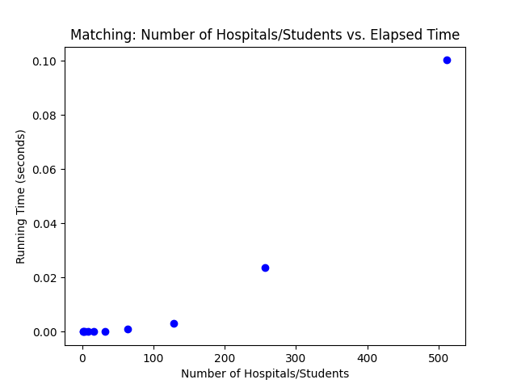
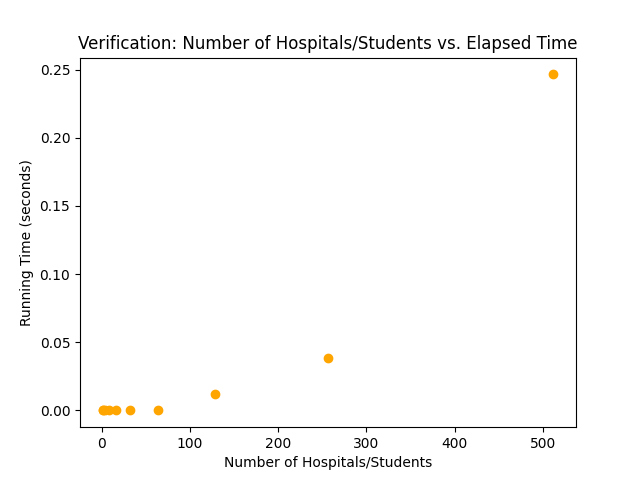

"# 1.-Matching-and-Verifying" 

Students:

Davis Pham - 38499319

Lane Chin - 15117678


The scalability function has a single dependency:

matplotlib

To Install:

```
pip install matplotlib
```


To compile and run matcher and validator with input file:

```
py src/main.py < test/example.in


py src/main.py < test/data1.in 
- to run one hospital and one student
py src/main.py < test/data2.in 
- to run empty file

```

To run the scalability and create plots:

```
py src/scalability.py
```


Assumptions:

1. There are equal number of student and hospitals.
2. The input format is followed, and preferences are ranked by integers.


Matching Time Plot




Verification Time Plot


